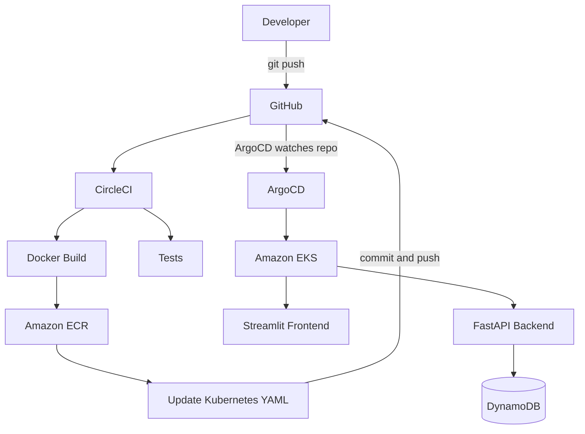

# Todo EKS GitOps


A production-style **GitOps** project that deploys a full-stack Todo application to **Amazon EKS**. A `git push` triggers **CircleCI** to build and push Docker images to **Amazon ECR** and update the Kubernetes manifests, and **ArgoCD** then syncs the change to the cluster automatically. No manual `kubectl apply` is needed after the initial setup.

---

## Table of Contents

- [Features](#features)
- [Architecture](#architecture)
- [Tech Stack](#tech-stack)
- [Project Structure](#project-structure)
- [Prerequisites](#prerequisites)
- [Getting Started](#getting-started)
  - [1. Run locally](#1-run-locally)
  - [2. Build and push images](#2-build-and-push-images)
  - [3. Provision infrastructure](#3-provision-infrastructure)
  - [4. Deploy the application](#4-deploy-the-application)
  - [5. Install ArgoCD](#5-install-argocd)
- [CI/CD Pipeline](#cicd-pipeline)
- [Security: IRSA](#security-irsa)
- [Configuration](#configuration)
- [API Reference](#api-reference)
- [Testing the GitOps Flow](#testing-the-gitops-flow)
- [Known Considerations](#known-considerations)
- [Cleanup](#cleanup)
- [Author](#author)

---

## Features

- **Full GitOps workflow:** Git is the single source of truth, and ArgoCD reconciles the cluster to match it.
- **Automated CI/CD:** every push builds, tags (`CIRCLE_SHA1`), pushes and deploys new images.
- **Infrastructure as Code:** VPC, subnets, NAT, EKS, node group, IAM and OIDC are all managed by Terraform.
- **Keyless AWS access:** the backend reaches DynamoDB through IAM Roles for Service Accounts (IRSA), with no static credentials in pods.
- **Self-healing deployments:** ArgoCD automated sync with `prune` and `selfHeal` enabled.
- **Serverless database:** DynamoDB in on-demand (pay-per-request) mode.

## Architecture



**Request path:**

```
Internet -> AWS Load Balancer -> Streamlit (8501) -> todo-backend:8000 (FastAPI) -> DynamoDB
```

## Tech Stack

| Layer | Technology |
|-------|-----------|
| Frontend | Streamlit |
| Backend | FastAPI, Uvicorn, boto3 |
| Database | Amazon DynamoDB |
| Containers | Docker (`python:3.12-slim`) |
| Registry | Amazon ECR |
| Orchestration | Amazon EKS (Kubernetes 1.33) |
| Infrastructure | Terraform |
| CI | CircleCI |
| CD / GitOps | ArgoCD |
| Auth to AWS | IAM Roles for Service Accounts (IRSA) |

## Project Structure

```
todo-eks-gitops/
├── app/
│   ├── backend/
│   │   ├── app.py
│   │   ├── requirements.txt
│   │   └── Dockerfile
│   └── frontend/
│       ├── app.py
│       ├── requirements.txt
│       └── Dockerfile
├── terraform/
│   ├── main.tf
│   ├── variables.tf
│   ├── eks.tf
│   ├── iam.tf
│   └── .terraform.lock.hcl
├── kubernetes/
│   ├── backend.yaml
│   ├── frontend.yaml
│   └── serviceaccount.yaml
├── argocd/
│   └── application.yaml
├── .circleci/
│   └── config.yml
└── .gitignore
```

## Prerequisites

- [AWS CLI](https://docs.aws.amazon.com/cli/latest/userguide/getting-started-install.html), configured with credentials
- [Terraform](https://developer.hashicorp.com/terraform/install)
- [kubectl](https://kubernetes.io/docs/tasks/tools/)
- [Docker](https://docs.docker.com/get-docker/)
- Python 3.12+
- A GitHub account and a [CircleCI](https://circleci.com/) project connected to this repo

## Getting Started

### 1. Run locally

Create the DynamoDB table first (see [Configuration](#configuration)), then:

```bash
# Backend
cd app/backend
pip install -r requirements.txt
uvicorn app:app --reload          # http://localhost:8000

# Frontend (new terminal)
cd app/frontend
pip install -r requirements.txt
streamlit run app.py              # http://localhost:8501
```

Verify that you can add, list and delete todos.

### 2. Build and push images

```bash
# Build
docker build -t todo-backend  ./app/backend
docker build -t todo-frontend ./app/frontend

# Authenticate to ECR
aws ecr get-login-password --region us-east-2 | \
  docker login --username AWS --password-stdin <ACCOUNT_ID>.dkr.ecr.us-east-2.amazonaws.com

# Tag and push (repeat for todo-frontend)
docker tag  todo-backend:latest <ACCOUNT_ID>.dkr.ecr.us-east-2.amazonaws.com/todo-backend:latest
docker push <ACCOUNT_ID>.dkr.ecr.us-east-2.amazonaws.com/todo-backend:latest
```

### 3. Provision infrastructure

```bash
cd terraform
terraform init
terraform plan
terraform apply
```

This creates a VPC (`10.0.0.0/16`) with two public and two private subnets across two AZs, a single NAT gateway, the `todo-eks-cluster` EKS cluster, a managed node group (`todo-eks-nodes`, 2 x `t3.small`), and the IAM and OIDC resources.

Configure `kubectl` and verify the nodes:

```bash
aws eks update-kubeconfig --region us-east-1 --name todo-eks-cluster
kubectl get nodes
```

### 4. Deploy the application

Initial bootstrap only. After ArgoCD is set up, deployments are automatic.

```bash
kubectl apply -f kubernetes/serviceaccount.yaml
kubectl apply -f kubernetes/backend.yaml
kubectl apply -f kubernetes/frontend.yaml

kubectl get pods
kubectl get services      # frontend exposes an AWS LoadBalancer
```

### 5. Install ArgoCD

```bash
kubectl create namespace argocd
kubectl apply -n argocd -f https://raw.githubusercontent.com/argoproj/argo-cd/stable/manifests/install.yaml

# Access the UI
kubectl port-forward svc/argocd-server -n argocd 8080:443   # https://localhost:8080

# Register the application
kubectl apply -f argocd/application.yaml
kubectl get application -n argocd                            # expect: Synced / Healthy
```

ArgoCD is configured to watch the `kubernetes/` path on the `master` branch with `prune: true` and `selfHeal: true`.

## CI/CD Pipeline

```
git push -> CircleCI -> AWS auth -> ECR login -> Docker build -> Docker push
         -> update image tags in kubernetes/*.yaml -> commit and push to master
         -> ArgoCD detects the change -> sync -> new pods on EKS
```

Images are tagged with the commit SHA (`CIRCLE_SHA1`), so every deployment is traceable to an exact commit.

**Required CircleCI project environment variables:**

| Variable | Purpose |
|----------|---------|
| `AWS_ACCESS_KEY_ID` | AWS credentials for ECR push |
| `AWS_SECRET_ACCESS_KEY` | AWS credentials for ECR push |
| `AWS_DEFAULT_REGION` | ECR region (`us-east-2`) |
| `GITHUB_TOKEN` | Token with repository **Contents: read/write** to update manifests |

> **Tip:** Add `[skip ci]` to the manifest-update commit message (or ignore the `kubernetes/` path) so that CircleCI's own push does not trigger another pipeline run.

## Security: IRSA

The backend has **no AWS access keys**. Access is granted through a chain of trust:

```
Pod -> ServiceAccount (todo-backend) -> IAM Role (todo-backend-dynamodb-role) -> DynamoDB policy
```

The role is annotated on the ServiceAccount with `eks.amazonaws.com/role-arn` and allows only these actions on the `todo-app-todos` table:

`dynamodb:GetItem`, `dynamodb:PutItem`, `dynamodb:UpdateItem`, `dynamodb:DeleteItem`, `dynamodb:Scan`

## Configuration

**DynamoDB table**

| Setting | Value |
|---------|-------|
| Name | `todo-app-todos` |
| Region | `us-east-2` |
| Partition key | `id` (Number) |
| Billing mode | `PAY_PER_REQUEST` |

**Environment variables**

| Service | Variable | Default |
|---------|----------|---------|
| Backend | `AWS_REGION` | `us-east-2` |
| Backend | `DYNAMODB_TABLE` | `todo-app-todos` |
| Frontend | `API_URL` | `http://localhost:8000` (local), `http://todo-backend:8000` (in cluster) |

## API Reference

| Method | Endpoint | Description |
|--------|----------|-------------|
| `GET` | `/todos` | List all todos |
| `POST` | `/todos` | Create a todo |
| `DELETE` | `/todos/{id}` | Delete a todo by ID |

FastAPI also serves interactive docs at `/docs` when running.

## Testing the GitOps Flow

1. Change something visible in `app/frontend/app.py` (for example the title).
2. Commit and push:
   ```bash
   git add app/frontend/app.py
   git commit -m "Update frontend UI"
   git push origin master
   ```
3. Watch it roll out:
   ```bash
   kubectl get application -n argocd
   kubectl get pods
   kubectl get deployment todo-frontend
   ```
4. Refresh the LoadBalancer URL to see the change.

## Known Considerations

- **Mixed regions:** the VPC and EKS cluster run in `us-east-1`, while ECR, DynamoDB and CircleCI use `us-east-2`. This works, but consolidating to a single region reduces latency and cost.
- **CI credentials:** consider a dedicated least-privilege IAM user (ECR push only) or CircleCI OIDC instead of long-lived access keys.
- **Terraform state:** `*.tfstate` and `*.tfvars` are git-ignored. Use a remote backend (S3 plus DynamoDB locking) for team use. Keep `.terraform.lock.hcl` committed.

## Cleanup

Delete the Kubernetes resources first so the AWS load balancer is removed, then destroy the infrastructure to avoid ongoing charges (EKS control plane, NAT gateway and nodes are billed hourly):

```bash
kubectl delete application todo-app -n argocd
kubectl delete -f kubernetes/
cd terraform && terraform destroy
```

Also delete the ECR repositories and the DynamoDB table if you no longer need them.

## Author

**Pratik**, GitHub: [@iampratik11](https://github.com/iampratik11)

---

If you found this project useful, consider giving it a star.
